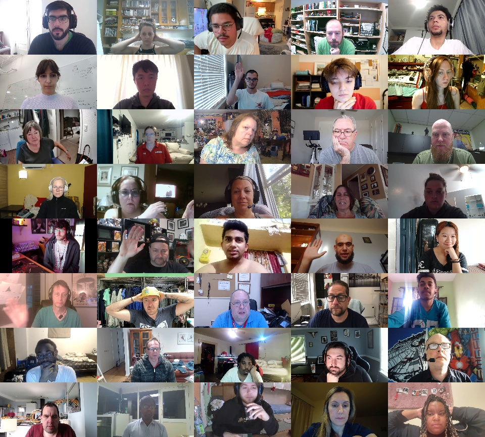
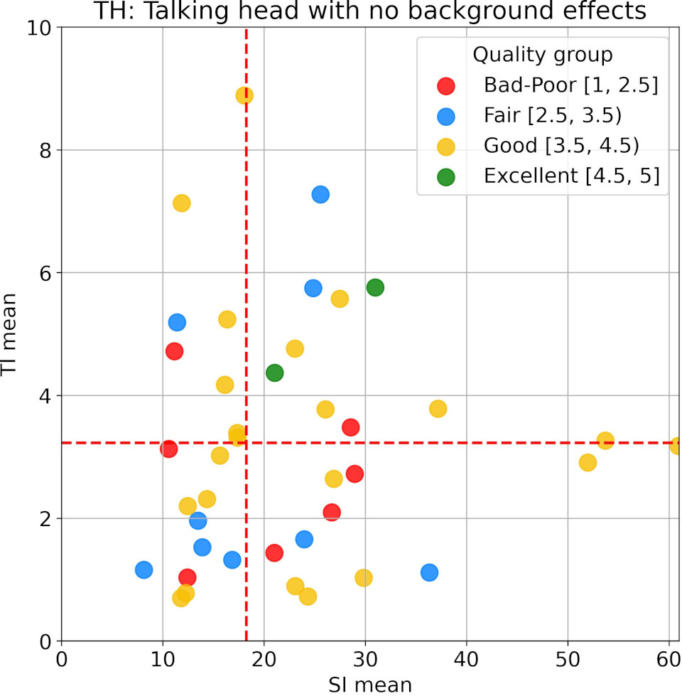
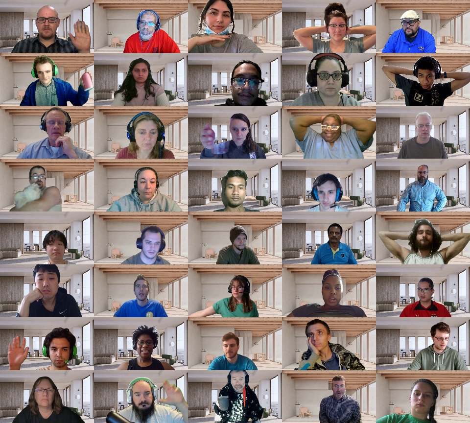
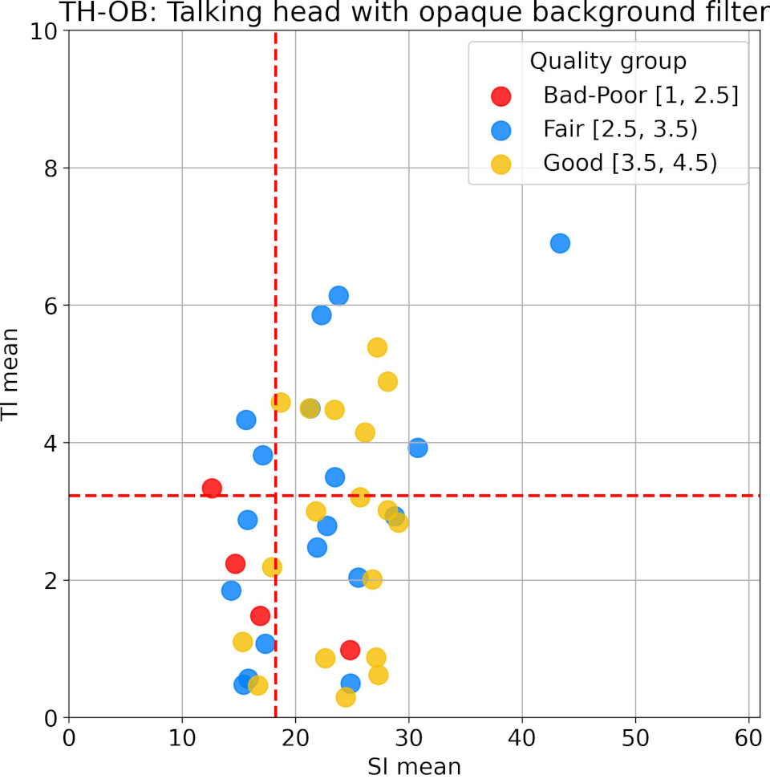
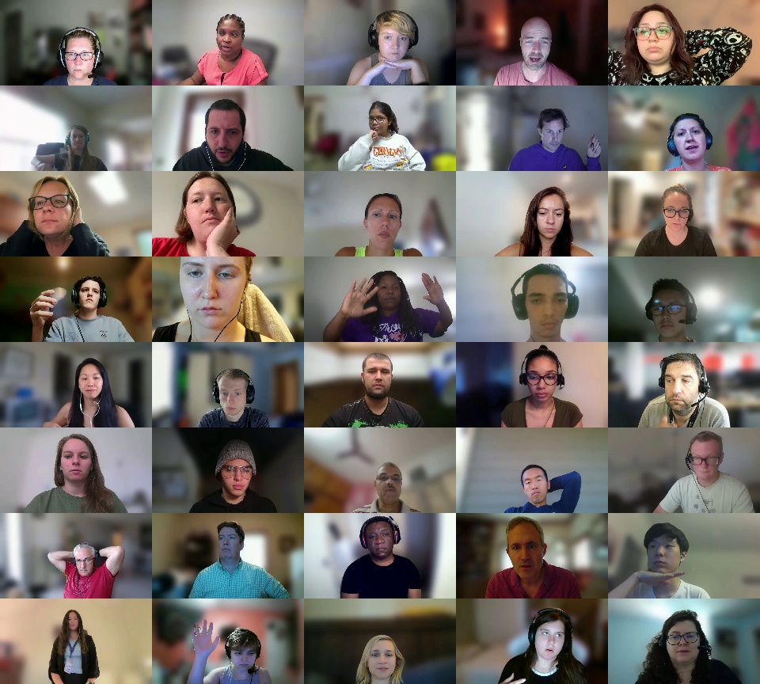
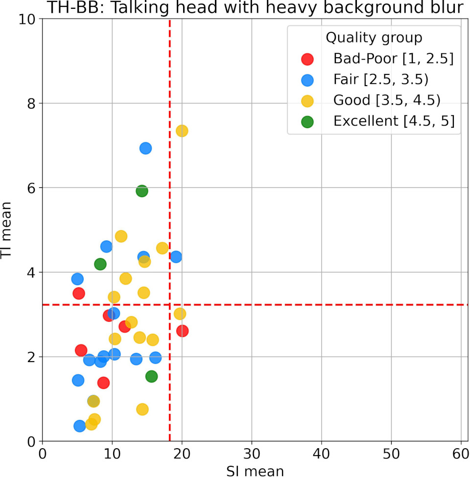
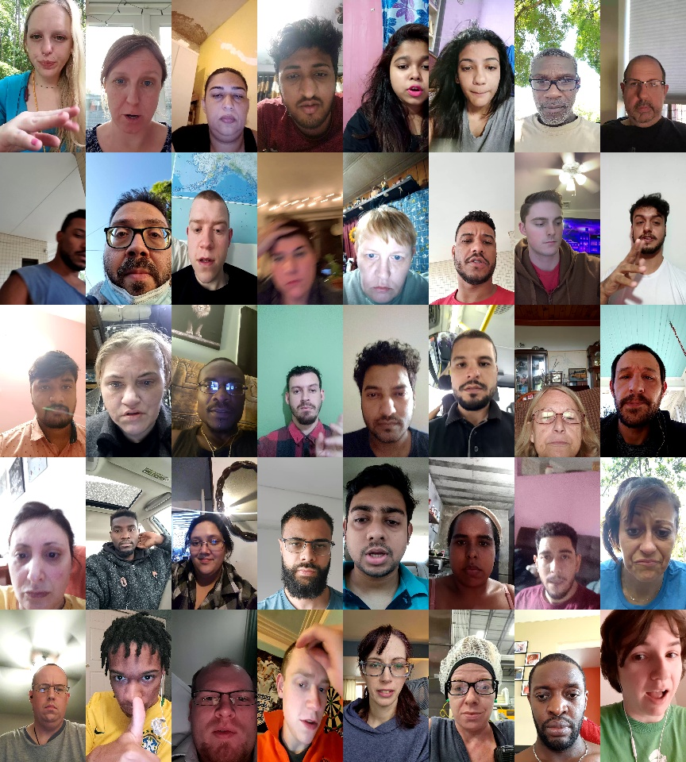
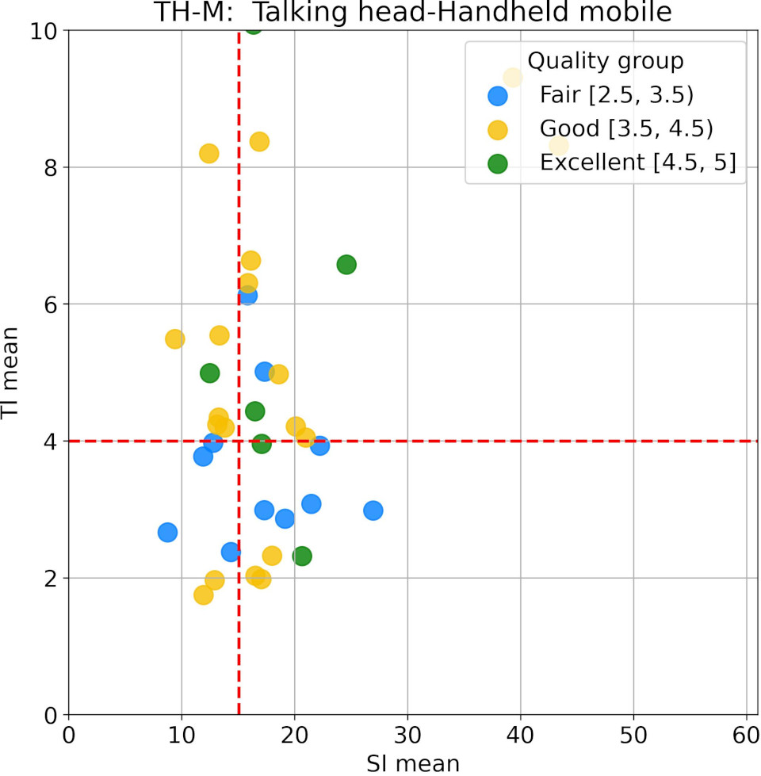

# Video Conferencing Dataset (VCD)


The Video Conferencing Dataset (VCD) is designed to evaluate video codecs for video conferencing. The VCD encompasses a broad range of camera qualities, along with spatial and temporal information. This dataset comprises 160 video clips, organized into four scenarios. Each sequence is presented in 1080p resolution, at 30 FPS, with a duration of 10 seconds, and features a person visible throughout the entire video. For further details, please refer to [VCD: A Video Conferencing Dataset for Video Compression](https://arxiv.org/abs/2309.07376).


## Citation

```BibTex
@inproceedings{naderi2024vcd,
  title={VCD: A Video Conferencing Dataset for Video Compression},
  author={Naderi, Babak and Cutler, Ross and Khongbantabam, Nabakumar Singh and Hosseinkashi, Yasaman and Turbell, Henrik and Sadovnikov, Albert and Zou, Quan},
  booktitle={ICASSP 2024-2024 IEEE International Conference on Acoustics, Speech and Signal Processing (ICASSP)},
  pages={3970--3974},
  year={2024},
  organization={IEEE}
}
```

## Download

Clone the repository and use *one of the methods* below to download the video clips:

```bash
git clone https://github.com/microsoft/VCD.git
cd download
```
### Method 1: Using Bash

Run the bash code to download the files in the current directory:

```bash
# download yuv files
bash download-vcd1-yuv.sh

# download mp4 files
bash download-vcd1-mp4.sh
```

### Method 2: Using python

1. Install the required libraries.

```bash
pip install -r requirements.txt
```

2. Change LOCAL_PATH to a path in your file system and run the following command. To download mp4 files, replace yuv_list.txt with mp4_list.txt.

```bash
python downloader.py --list-of-files yuv_list.txt  --local-path LOCAL_PATH
```


## Further details
The dataset includes 160 videos, organized into four scenarios with 40 clips each:

### 1. Talking Head (TH)
40 webcam videos in a talking head scenario with at least 30% of clips featuring active speaking. Participants were asked to perform gestures, movements, or read a text during recording.

<table>
    <tr>
        <td style="text-align:center"></td>
        <td style="text-align:center"></td>
    </tr>
</table>


### 2. Talking Head - Opaque Background (TH-OB)
Similar to the Talking Head scenario, however, backgrounds are replaced with two popular backgrounds used in Teams.


<table>
    <tr>
        <td style="text-align:center"></td>
        <td style="text-align:center"></td>
    </tr>
</table>

### 3. Talking Head - Background Blur (TH-BB)
A scenario similar to the Talking Head but with heavy background blur.


<table>
    <tr>
        <td style="text-align:center"></td>
        <td style="text-align:center"></td>
    </tr>
</table>

### 4. Talking Head - Mobile (TH-M)
40 talking head videos recorded in a mobile scenario.

<table>
    <tr>
        <td style="text-align:center"></td>
        <td style="text-align:center"></td>
    </tr>
</table>

## Contributing

This project welcomes contributions and suggestions. Most contributions require you to agree to a
Contributor License Agreement (CLA) declaring that you have the right to, and actually do, grant us
the rights to use your contribution. For details, visit https://cla.opensource.microsoft.com.

When you submit a pull request, a CLA bot will automatically determine whether you need to provide
a CLA and decorate the PR appropriately (e.g., status check, comment). Simply follow the instructions
provided by the bot. You will only need to do this once across all repos using our CLA.

This project has adopted the [Microsoft Open Source Code of Conduct](https://opensource.microsoft.com/codeofconduct/).
For more information see the [Code of Conduct FAQ](https://opensource.microsoft.com/codeofconduct/faq/) or
contact [opencode@microsoft.com](mailto:opencode@microsoft.com) with any additional questions or comments.


# Legal Notices

Microsoft and any contributors grant you a license to the Microsoft documentation in this repository under the [Creative Commons Attribution 4.0 International Public License](https://creativecommons.org/licenses/by/4.0/legalcode),
see the [LICENSE](LICENSE) file, grant you a license to any code in the repository under the [MIT License](https://opensource.org/licenses/MIT), see the
[LICENSE-CODE](LICENSE-CODE) file, and grant you a license to dataset in the repository under the [Community Data License Agreement – Permissive, Version 2.0 - CDLA](https://cdla.dev/permissive-2-0/), see the [LICENSE-DATA](LICENSE-DATA) file.

Microsoft, Windows, Microsoft Azure and/or other Microsoft products and services referenced in the
documentation may be either trademarks or registered trademarks of Microsoft in the United States
and/or other countries. The licenses for this project do not grant you rights to use any Microsoft
names, logos, or trademarks. Microsoft's general trademark guidelines can be found at
http://go.microsoft.com/fwlink/?LinkID=254653.

Privacy information can be found at https://privacy.microsoft.com/en-us/

Microsoft and any contributors reserve all other rights, whether under their respective copyrights, patents,
or trademarks, whether by implication, estoppel or otherwise.

## Dataset license

This dataset is released under the [Community Data License Agreement – Permissive, Version 2.0 - CDLA](https://cdla.dev/permissive-2-0/), see the [LICENSE-DATA](LICENSE-DATA) file.


## Code license

MIT License

Copyright (c) Microsoft Corporation.

Permission is hereby granted, free of charge, to any person obtaining a copy
of this software and associated documentation files (the "Software"), to deal
in the Software without restriction, including without limitation the rights
to use, copy, modify, merge, publish, distribute, sublicense, and/or sell
copies of the Software, and to permit persons to whom the Software is
furnished to do so, subject to the following conditions:

The above copyright notice and this permission notice shall be included in all
copies or substantial portions of the Software.

THE SOFTWARE IS PROVIDED "AS IS", WITHOUT WARRANTY OF ANY KIND, EXPRESS OR
IMPLIED, INCLUDING BUT NOT LIMITED TO THE WARRANTIES OF MERCHANTABILITY,
FITNESS FOR A PARTICULAR PURPOSE AND NONINFRINGEMENT. IN NO EVENT SHALL THE
AUTHORS OR COPYRIGHT HOLDERS BE LIABLE FOR ANY CLAIM, DAMAGES OR OTHER
LIABILITY, WHETHER IN AN ACTION OF CONTRACT, TORT OR OTHERWISE, ARISING FROM,
OUT OF OR IN CONNECTION WITH THE SOFTWARE OR THE USE OR OTHER DEALINGS IN THE
SOFTWARE


## Trademarks

This project may contain trademarks or logos for projects, products, or services. Authorized use of Microsoft 
trademarks or logos is subject to and must follow 
[Microsoft's Trademark & Brand Guidelines](https://www.microsoft.com/en-us/legal/intellectualproperty/trademarks/usage/general).
Use of Microsoft trademarks or logos in modified versions of this project must not cause confusion or imply Microsoft sponsorship.
Any use of third-party trademarks or logos are subject to those third-party's policies.
